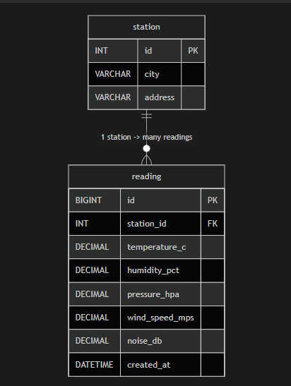
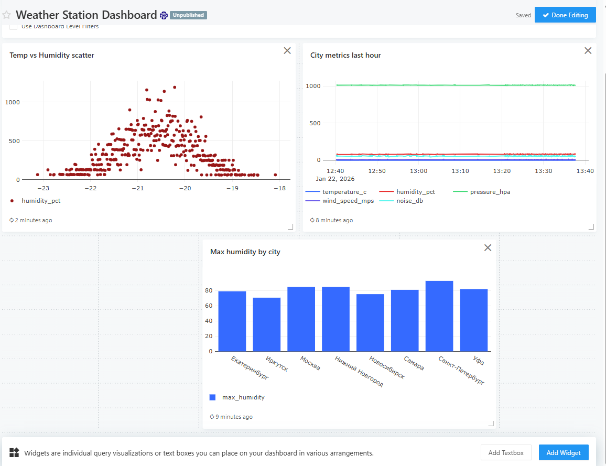
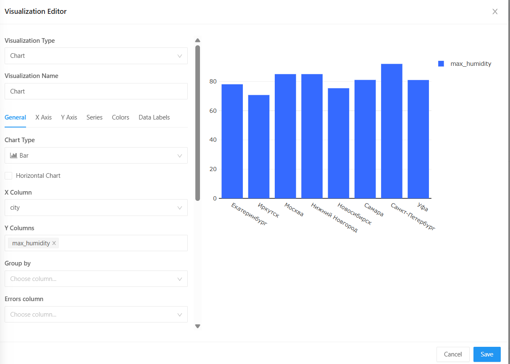
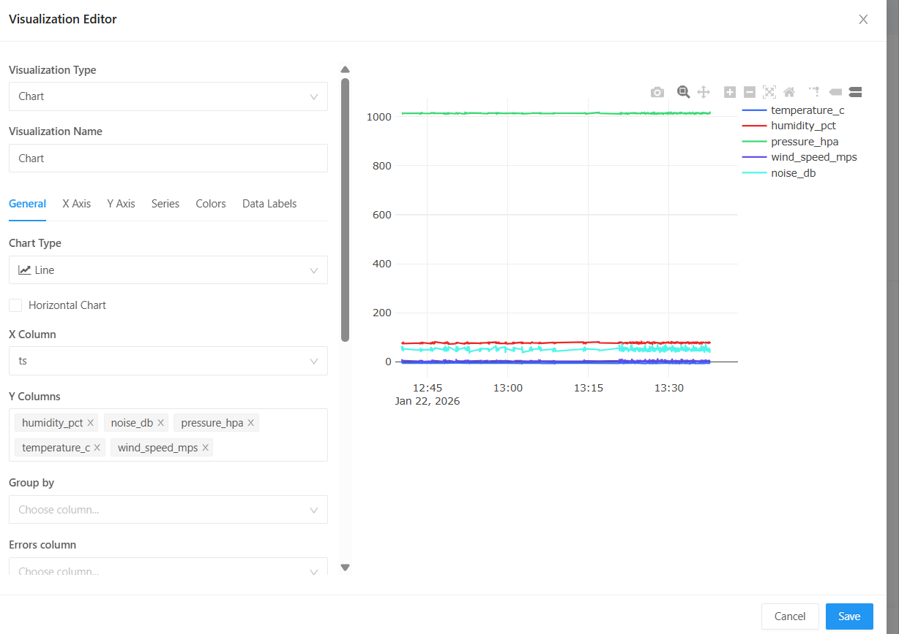
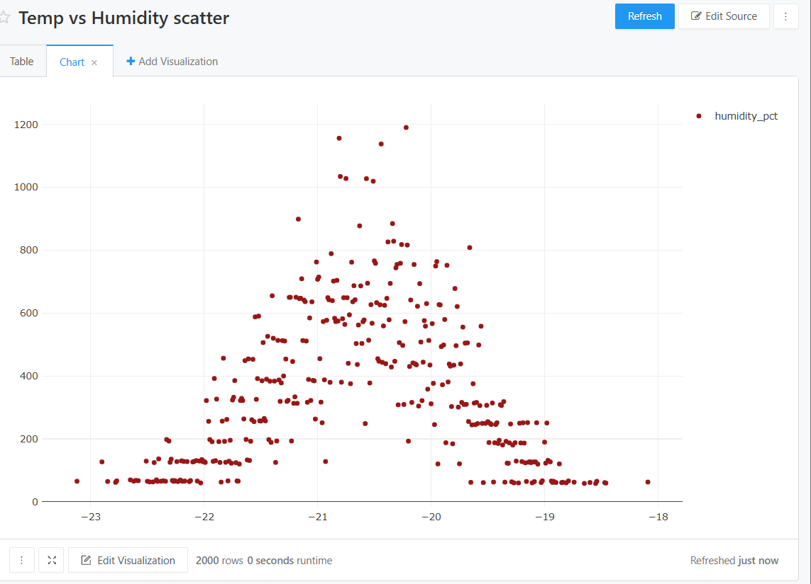

# Мини-система сбора и анализа данных для ПО «Погодная станция»

Проект генерирует осмысленные погодные показания (температура, влажность, давление, ветер, шум), сохраняет их в MySQL и позволяет анализировать через Redash (дашборд с 3+ визуализациями).

---

## ER-диаграмма БД

На рисунке ниже показана ER-диаграмма базы данных, используемой в проекте:



**Структура БД:**
- `station` — справочник станций (город, адрес)
- `reading` — измерения станции во времени (температура, влажность, давление, ветер, шум)
- Связь: `reading.station_id` → `station.id` (одна станция — много измерений)
- Индекс в `reading`: `idx_station_time` по `(station_id, created_at)` для быстрых запросов по станции и времени

---

## Требования

- Docker + Docker Compose
- Свободные порты: **80**, **3306**, **5000**

---

## Запуск проекта

### 1) Клонирование репозитория
```bash
git clone https://github.com/DDLST/Weather-station-analytics.git
cd Weather-station-analytics
```

### 2) Настройка переменных окружения
Создай `.env` из примера и замени пароли:
```bash
cp .env.example .env
```

### 3) Запуск сервисов
```bash
docker compose -f docker-compose.yaml up -d --build
```

### 4) Инициализация Redash (выполняется один раз)
```bash
docker compose -f docker-compose.yaml run --rm redash_server create_db
```

---

## Redash

### Открыть в браузере
```text
http://<IP_сервера>
```
При первом запуске Redash попросит создать пользователя (Initial Setup).

### Подключение MySQL как Data Source
Settings → Data Sources → New Data Source → MySQL

Параметры подключения:
- Host: `mysql`
- Port: `3306`
- Database: `weather_station`
- User: `ws_user`
- Password: пароль из `.env`

---

## Скриншоты

### Примеры созданных дашбордов в Redash




---

## Остановка проекта
```bash
docker compose -f docker-compose.yaml down
```

---

## Важные замечания (VDS Ubuntu)

### Оптимизация Redash под 2 GB RAM
Чтобы Redash не “съедал” всю оперативную память и не вызывал таймауты, в `docker-compose.yaml` уменьшили нагрузку:
- `REDASH_WEB_WORKERS`: **4 → 1**
- `WORKERS_COUNT`: **2 → 1**
- `QUEUES`: оставили `"queries,scheduled_queries,schemas"`

### Управление генератором данных
Во время настройки Redash генератор временно останавливался, затем был включён обратно:
- Остановка:
```bash
docker compose -f docker-compose.yaml stop generator
```
- Запуск:
```bash
docker compose -f docker-compose.yaml start generator
```
